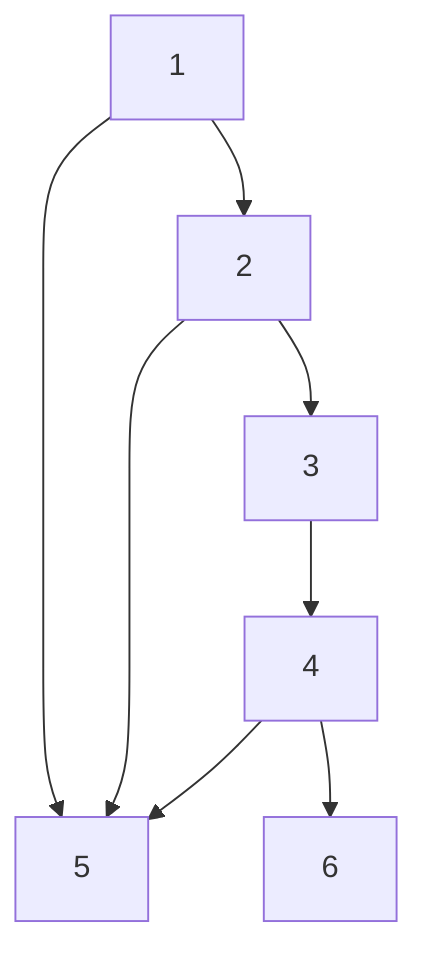

## 개요
> 포드 풀커슨 알고리즘(Ford-Fulkerson algorithm , FFA) 는 최대 플로우를 풀기 위한 알고리즘이다.  
이 알고리즘은 기본적으로 그래프 알고리즘과 그에 속해 있는 `DFS` 와 `BFS` 를 활용하여 구현되는데 그 구현 방식 또한 매우 다양해서 포드 폴커슨 방법 이라고도 불린다.  
우선 포드 폴커슨 알고리즘을 알아보기 전에 기본 그래프 알고리즘에 대해 알아보겠다.

# Graph Algorithm

## 그래프의 표현 방법

그래프란 노드(node) 집합 V와 엣지(edge) 집합 E로 구성되어 있는 자료구조이다.  이를 &&G= (v,E)&&라 표현한다.

## 너비 우선 탐색 (DFS)

너비 우선 탐색 알고리즘은 가장 단순한 그래프 검색 알고리즘 중 하나로, 다른 중요 그래프 알고리즘들의 원형이다.  

주어진 그래프 G= (v,E)와 출발점 s(source)에 대해 너비 우선 탑색은 s로 부터 도달할 수 있는 모든 정점을 발견하기 위해 G그래프의 간선을 체계적으로 탐색한다.

# Ford-Fulkerson Algorithm 

> Ford-Fulkerson Algorithm 줄여서 FFA는 네트워크 유량(network flow)의 최댓값을 구하는 알고리즘으로, 그리디 알고리즘에 속한다.

참고  
https://blog.naver.com/kks227/220804885235