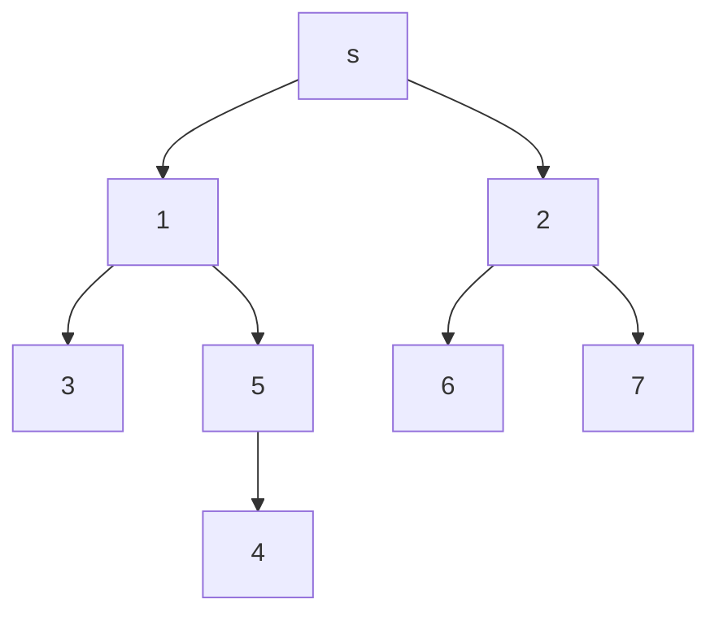
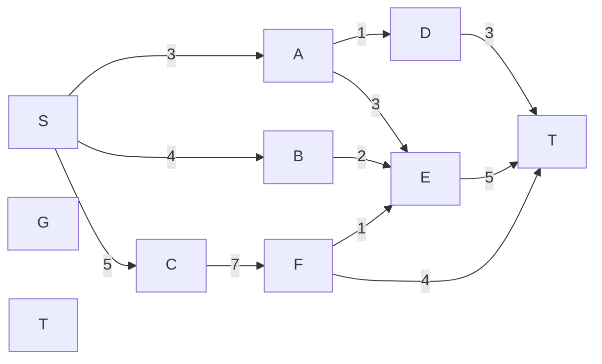

## 개요
> 포드 풀커슨 알고리즘(Ford-Fulkerson algorithm , FFA) 는 최대 플로우를 풀기 위한 알고리즘입니다.
이 알고리즘은 기본적으로 그래프 알고리즘과 그에 속해 있는 `DFS` 와 `BFS` 를 활용하여 구현되는데 그 구현 방식 또한 매우 다양해서 포드 폴커슨 방법 이라고도 불립니다. 
우선 포드 폴커슨 알고리즘을 알아보기 전에 기본 그래프 알고리즘에 대해 알아보았습니다.

# Graph Algorithm

## 그래프의 표현 방법

그래프란 노드(node) 집합 V와 엣지(edge) 집합 E로 구성되어 있는 자료구조이다.  이를 &&G= (v,E)&&라 표현한다.  
그래프는 크게 무향 그래프와 유향 그래프로 나눌 수 있습니다. 무향그래프는 어느 방향으로든 이도할 수 있고 유향그래프는 이동 가능한 경로가 정해져 있습니다
그래프에서 노드간에 간선 하나로 이동 가능한 경우 인접한다(adjacent)라고 표현합니다.

## 너비 우선 탐색 (DFS)

너비 우선 탐색 알고리즘은 가장 단순한 그래프 검색 알고리즘 중 하나로, 다른 중요 그래프 알고리즘들의 원형입니다. 


주어진 그래프 G= (v,E)와 출발점 s(source)에 대해 너비 우선 탑색은 s로 부터 도달할 수 있는 모든 정점을 발견하기 위해 G그래프의 간선을 체계적으로 탐색합니다.


위와 같은 그래프가 있을 때, DFS 노드 하나를 택한 후 그 노드의 방문하지 않은 인접한 노드 중 하나를 택해 방문하고 더 이상 인접한 노드가 없을 때까지 이를 반복합니다.  
처음 방문한 S노드의 인접한 노드는 1과 2번입니. 이 중 작은 번호 1번을 방문한 뒤, 시작 노드가 1번으로 바뀌며 1번의 인접한 노드인 3,5번 노드 중 하나를 방문할 것입니다. 3과 5번 노드 중 3번 노드를 방문합니다.  

 이제 3번노드에서 더 이상 방문할 인접한 노드가 없습니다. 이 때 자신을 호출한 1번 노드로 돌아가 아직 방문하지 않은 노드가 있는지 확인하고, 이를 계속 반복해 나가 7번 노드까지 모드 방문하게 되는 방식입니다.  

### 구현 방식
DFS 구현에서 가장 중요한 점은 더 이상 방문할 노드가 없을 때 자신을 불렀던 정점으로 돌아가야 하는 것입니다.  
이때 DFS 는 자신이 방문한 노드를 스택에 쌓고, 방문이 끝나면 pop하는 형태로 구현이 된다. 따라서 위의 그래프로 생각해보면 스택에 {s, 1 , 3}이 쌓이고, 더 이상 방문 할 것이 없는 3 을 pop 하면 { s, 1} 이 남게 되고, 3을 호출한 1로 돌아갈 수 있게 됩니다.

```c++
#include <iostream>
#include <vector>
#include <algorithm>
using namespace std;

class Graph {
public:
	int V; //노드의 개수
	vector<vector<int>> adj;// 인접 노드 리스트
	vector<int> visit; // 방문 여부 확인

	Graph() : V(0) {}
	Graph(int n) {
		V = n;
		// 배열들의 크기 리사이징
		adj.resize(n);
		visit.resize(n);
	}
	//노드 추가 함수
	void add_edge(int u, int v)
	{
		// 입력받은 노드 정보를 추가
		adj[u].push_back(v); 
		adj[v].push_back(u);
	}

	// 노드 정렬 함수
	void sort_adj()
	{
		for (int i = 0; i < V; i++)
		{
			sort(adj[i].begin(), adj[i].end());
		}
	}

	// 방문여부 초기화 후 시작
	void DFS()
	{
		for (auto& x : visit)
			x = 0;
		DFS(0);
	}

private:
	void DFS(int curr)
	{
		visit[curr] = 1; // 현재 방문 노드 체크
		cout << curr << '\n'; // 방문 노드 출력
		// 현재 노드 인접 노드 중 방문 하지 않은 노드 여부 확인 후
		for (auto next : adj[curr])
			if (!visit[next])
				DFS(next); // 함수를 재귀적으로 구현하여 모든 노드를 방문 할 수 잇게 구현
	}
};
int main()
{
	int N;
	cin >> N; // 노드의 개수 입력
	Graph G(N);
	int k;
	cin >> k; // 인접노드 개수 입력
	for (int i = 0; i < k; i++)
	{
		int u, v; cin >> u >> v; // 인접노드 입력
		G.add_edge(u, v);
	}
	G.sort_adj();
	G.DFS();
}
```
# Ford-Fulkerson Algorithm 

> 이제 대략적인 DFS 에 대한 이해가 끝났으므로 포드-풀커슨 알고리즘으로 넘어갑니다.  
Ford-Fulkerson Algorithm 줄여서 FFA는 네트워크 유량(network flow)의 최댓값을 구하는 알고리즘입니다.

## FFA의 이해

기본적으로 FFA 에는 두 노드 u, v 를 잇는 간선 (u,v)가 있을 때, 노드 u에서 v 방향으로 간선의 용량 이하만큼의 플로우를 보낼 수 있습니다. 이때 u에서 v 로의 용량은 c(u,v), 유량은 f(u,v)로 표현하겠습니다.  
최대 유량 그래프에는 서로 다른 두 노드 소스와 싱크가 정해져 있고, 소스에서 싱크로 보낼 수 있는 최대 유량을 구해내는 것이 목적입니다. 
유량그래프에는 몇가지 성질이 있습니다. 
첫째로는, 유량을 발생시키는 것은 소스노드 뿐이고, 나머지 노드들은 자신이 받은 플로우 만큼만 보낼 수 있습니다. 
둘째로는, 들어오는 유량의 총합과 나가는 유량의 총합이 같이야 합니다.  
마지막으로는, 간선(u,v) 방향으로 유량이 흐를 때, 그 역방향으로 음의 유량이 흐르는 것으로 취급해 줍니다.  
이 마지막 성질을 이해하면 FFA를 이해할 수 있습니다. 



위와 같은 용량을 가진 그래프의 최대유량을 구하는 문제를 포드-풀커슨 알고리즘을 이용하여 풀어보겠습니다.

## FFA의 동작 원리

포드-폴커슨 알고리즘의 동작원리는 간단하다.
우선, 플로우 그래프 G= (V,E) 와 플로우 f 에 대해 s에서 t로의 증강 경로(augmenting path)p를 찾는다. p상에 있는 모든 간선에는 여유용량이 남아 있어야 한다.  
그 다음 p의 각 간선에서 증가시킬 수 있는 플로우의 최대량을 찾는다. 이를 p의 잔여 용량(residual capacity)

