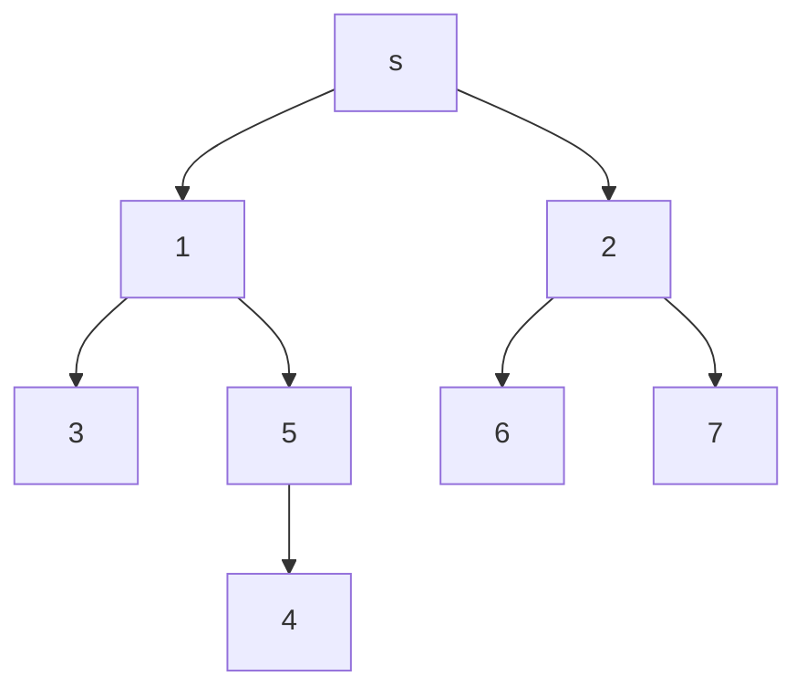

## 개요
> 포드 풀커슨 알고리즘(Ford-Fulkerson algorithm , FFA) 는 최대 플로우를 풀기 위한 알고리즘입니다.
이 알고리즘은 기본적으로 그래프 알고리즘과 그에 속해 있는 `DFS` 와 `BFS` 를 활용하여 구현되는데 그 구현 방식 또한 매우 다양해서 포드 폴커슨 방법 이라고도 불립니다. 
우선 포드 폴커슨 알고리즘을 알아보기 전에 기본 그래프 알고리즘에 대해 알아보았습니다.

# Graph Algorithm

## 그래프의 표현 방법

그래프란 노드(node) 집합 V와 엣지(edge) 집합 E로 구성되어 있는 자료구조이다.  이를 &&G= (v,E)&&라 표현한다.  
그래프는 크게 무향 그래프와 유향 그래프로 나눌 수 있습니다. 무향그래프는 어느 방향으로든 이도할 수 있고 유향그래프는 이동 가능한 경로가 정해져 있습니다
그래프에서 노드간에 간선 하나로 이동 가능한 경우 인접한다(adjacent)라고 표현합니다.

## 너비 우선 탐색 (DFS)

너비 우선 탐색 알고리즘은 가장 단순한 그래프 검색 알고리즘 중 하나로, 다른 중요 그래프 알고리즘들의 원형입니다. 


주어진 그래프 G= (v,E)와 출발점 s(source)에 대해 너비 우선 탑색은 s로 부터 도달할 수 있는 모든 정점을 발견하기 위해 G그래프의 간선을 체계적으로 탐색합니다.


위와 같은 그래프가 있을 때, DFS 노드 하나를 택한 후 그 노드의 방문하지 않은 인접한 노드 중 하나를 택해 방문하고 더 이상 인접한 노드가 없을 때까지 이를 반복합니다.  
처음 방문한 S노드의 인접한 노드는 1과 2번입니. 이 중 작은 번호 1번을 방문한 뒤, 시작 노드가 1번으로 바뀌며 1번의 인접한 노드인 3,5번 노드 중 하나를 방문할 것입니다. 3과 5번 노드 중 3번 노드를 방문합니다.  

 이제 3번노드에서 더 이상 방문할 인접한 노드가 없습니다. 이 때 자신을 호출한 1번 노드로 돌아가 아직 방문하지 않은 노드가 있는지 확인하고, 이를 계속 반복해 나가 7번 노드까지 모드 방문하게 되는 방식입니다.  

### 구현 방식
DFS 구현에서 가장 중요한 점은 더 이상 방문할 노드가 없을 때 자신을 불렀던 정점으로 돌아가야 하는 것이다.  
이때 DFS 는 자신이 방문한 노드를 스택에 쌓고, 방문이 끝나면 pop하는 형태로 구현이 된다. 따라서 위의 그래프로 생각해보면 스택에 {s, 1 , 3}이 쌓이고, 더 이상 방문 할 것이 없는 3 을 pop 하면 { s, 1} 이 남게 되고, 3을 호출한 1로 돌아갈 수 있게 된다.

```c++
#include <iostream>
using namespace std;
int main()
{
    class Graph
    {
        
    }
}
```
# Ford-Fulkerson Algorithm 

> Ford-Fulkerson Algorithm 줄여서 FFA는 네트워크 유량(network flow)의 최댓값을 구하는 알고리즘으로, 그리디 알고리즘에 속한다.


참고  
https://blog.naver.com/kks227/220804885235