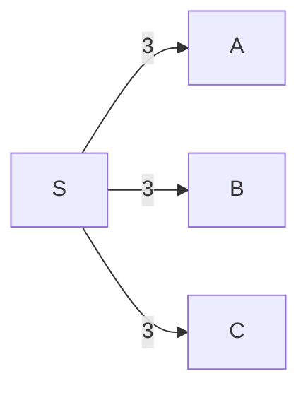

# Graph Algorithm
> 포드 풀커슨 알고리즘(Ford-Fulkerson algorithm) 줄여서 FFA라고 불리는 네트워크 최대 유량을 구하는 알고리즘은 그래프 알고리즘에 속해 있다.
> 이 알고리즘에서 증가경로를 찾는 방법은 그래프 알고리즘 중 깊이 우선 탐색(depth-first search, DFS)을 기본적으로 사용하기 때문에 이를 먼저 공부해 보았다.

## DFS

# Ford-Fulkerson Algorithm 

> Ford-Fulkerson Algorithm 줄여서 FFA는 네트워크 유량(network flow)의 최댓값을 구하는 알고리즘으로, 그리디 알고리즘에 속한다.

참고  
https://blog.naver.com/kks227/220804885235